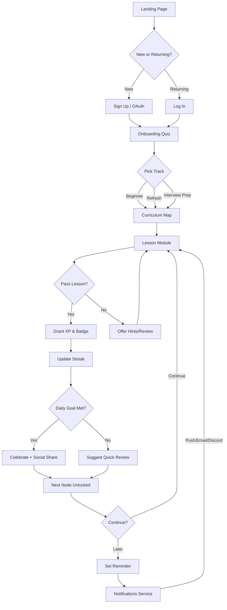
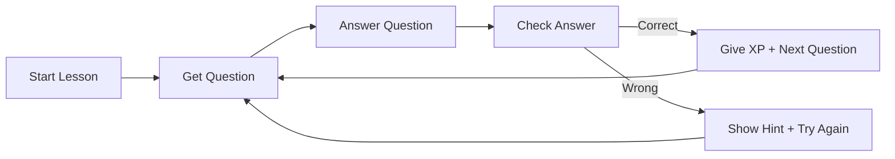

# Flowchart For Users

```mermaid
---
config:
  layout: dagre
---
flowchart TD
    A["Landing Page"] --> B{"New or Returning?"}
    B -- New --> C["Sign Up / OAuth"]
    B -- Returning --> D["Log In"]
    C --> E["Onboarding Quiz"]
    D --> E
    E --> F{"Pick Track"}
    F -- Beginner --> G["Curriculum Map"]
    F -- Refresh --> G
    F -- Interview Prep --> G
    G --> H["Lesson Module"]
    H --> I{"Pass Lesson?"}
    I -- Yes --> J["Grant XP & Badge"]
    I -- No --> K["Offer Hints/Review"]
    J --> L["Update Streak"]
    K --> H
    L --> M{"Daily Goal Met?"}
    M -- Yes --> N["Celebrate + Social Share"]
    M -- No --> O["Suggest Quick Review"]
    N --> P["Next Node Unlocked"]
    O --> P
    P --> Q{"Continue?"}
    Q -- Continue --> H
    Q -- Later --> R["Set Reminder"]
    R --> S["Notifications Service"]
    S -- Push/Email/Discord --> H
```
# Flowchart For Lesson Logic

```mermaid
flowchart LR
    A[Start Lesson] --> B[Get Question]
    B --> C[Answer Question]
    C --> D[Check Answer]
    D -->|Correct| E[Give XP + Next Question]
    D -->|Wrong| F[Show Hint + Try Again]
    E --> B
    F --> B
```